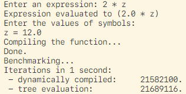
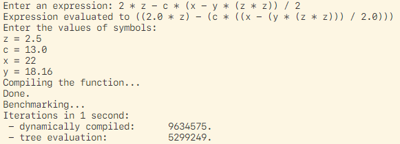
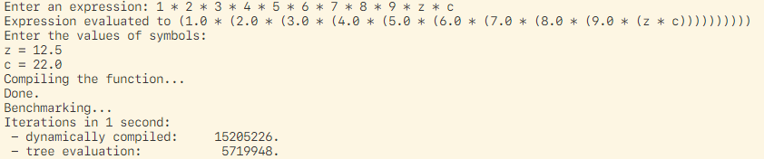

# Dynamic compilation

Small experiment testing the performance of dynamically compiled expressions versus parse tree evaluation. The need for this arose after I wrote an interpreter for drawing Mandelbrot variations and was interested in knowing whether if it was too slow to evaluate a parse tree for every pixel.

Code is dynamically compiled using the Reflect API using the following code:

```Scala
def compile(code: String): (MutableMap[String, Double]) => Double = {
    import reflect.runtime.universe
    import tools.reflect.ToolBox

    val tb = universe.runtimeMirror(getClass.getClassLoader).mkToolBox()

    tb.compile(
        tb.parse(
            s"""
                def lambda(variables: collection.mutable.Map[String, Double]): Double = {
                    $code
                }

                lambda _
            """.stripMargin
        )
    )().asInstanceOf[MutableMap[String, Double] => Double]
}
```

This returns a function that evaluates $code and has support for passing trough variables in form of a map. For general purposes this code should be generic. However doing this requires handling type erasure since the argument and return type of the lambda function need to be known during runtime.

## Benchmarks

### No. 1



For this simple expression the tree evaluation is actually faster, but it's within a margin of error so I'd call it even.

### No. 2



This expression is parsed into a bigger tree and we see the performance hit compared to the first example. The dynamically compiled code also performs worse since it needs more map calls based on how many symbols there are in the expression.

### No. 3



We see how deep the expression tree goes based on the parenthesis. This causes a dramatic decrease in performance, even though the expression is just stacked multiplication.